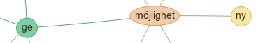

# Ordkoppla

Utforska vilka ord som förekommer ofta tillsammans!

En enkel JS-app som använder [Korp API](https://ws.spraakbanken.gu.se/ws/korp/v7/#basic-information).

Strecken mellan ordbubblorna visar att orden ofta förekommer tillsammans i en grammatisk relation.

